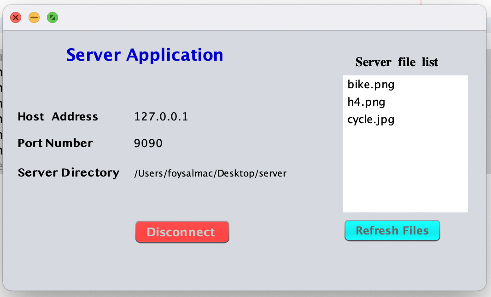

# fileTransferFTP
Here is a quick view

We develop a file server system by using java socket programming where users can upload files on the server and also can download and delete files from the server. At first start the server program then it starts the server socket and starts listening on port 9090(changeable in UI) , here you have to choose the server directory where all files will store which are uploaded by users and then start the server.
Interface will like bellow:

Then the client program should be run , client socket connected with server socket by entering server socket's IP address and port number. Here clients have to give the ip address of the server , port number of the server socket and have to select a directory where all files will be stored which client will download.
By clicking the start client button Client program creates a socket then sends a connection request to the server with the host Ip and port number. As the Server socket is listening when it gets a client request it accepts the
request and then they both get connected through this socket. When the server accepts a client request it sends all file information to the client. Interface of client program:

  
  
  Now the client can upload files , download files and delete the files.
Now in client gui , the client can see the server file and also the file which are in client local storage. For uploading the file after choosing the file it sends the file to the server. Server gets ready for receiving the file when it gets the command of uploading and receives the file from the client and saves the file to the server directory.

  

 When a client wants to download a file from the server it clicks the file from the file list and chooses the file. By pressing download it sends the command of downloading and id of the file to the server. Server receives
the command and file Id then it sends the file to the socket outputstream and client receives it through inputstream and saves the file.
When a client wants to delete a file from the server, the client has to choose the file and after clicking the delete button the client sends the command and file id to the server. When the server receives command and Id it deletes the file from the server.

